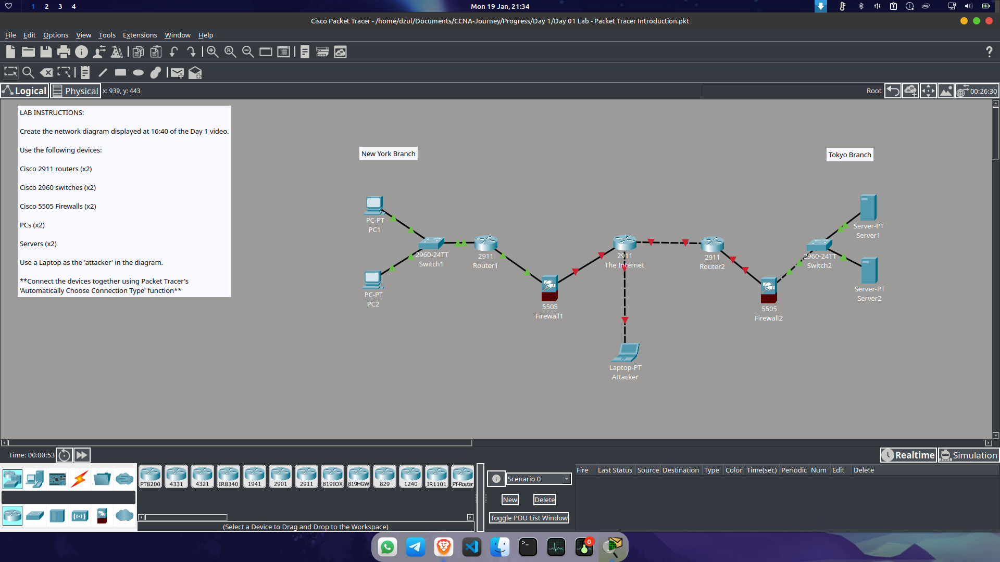

# CCNA Journey: Troubleshooting Lab

## 🌐 Initial Topology

---

## 🛠 Troubleshooting Log

### 1. Connectivity Issue: ASA 5505 to Router 2911
* **Problem:** The Cisco ASA 5505 Firewall failed to establish a link/connection with the Cisco 2911 Router.
* **Diagnosis:** Initial physical/logical port assignment was unresponsive.
* **Resolution:** Moved the uplink cable on the router side to the **Gig 0/2** port. The link successfully came up (Green), and traffic began to flow.

### 2. Reflection: Theory vs. Practice
Networking in a lab environment (or real world) is rarely as straightforward as it appears in textbooks. Even with a solid understanding of the logical traffic flow, configuration errors are common. 
* **Challenge:** The Firewall configuration remains the most complex and challenging part of this setup. It requires high precision in security levels and interface assignments.

### 3. 💡 Key Takeaway (Pro-tip)
> **"Check Layer 1 first."**
> 
> If the link indicator (cable) remains **red** despite correct software configurations, always verify the physical or logical port assignments. Ensure the interface you are configuring matches the one physically connected.

---
*Last updated: 2026-01-19*
