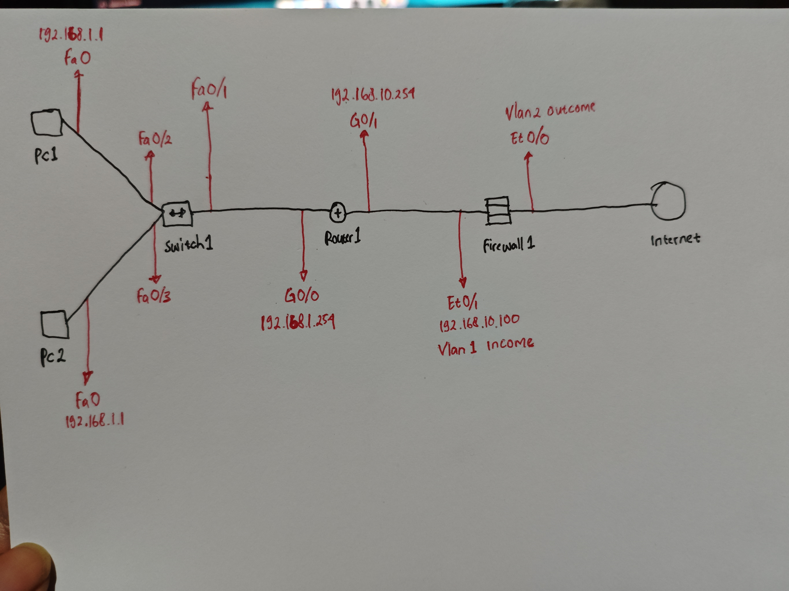
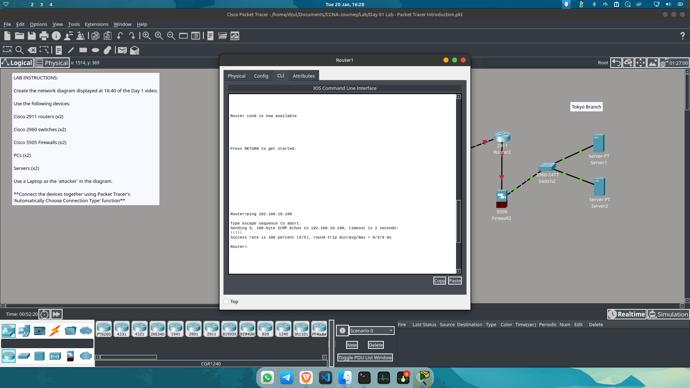
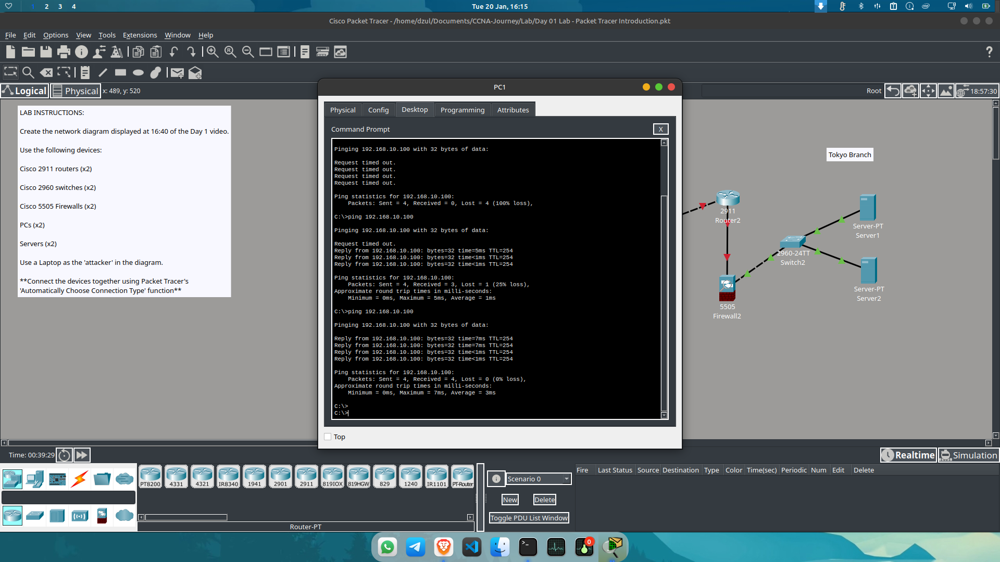

# Day 02: Solving IP Overlap and Implementing Firewall ACLs

**Date:** 20 Januari 2026
**Project Phase:** Inter-connectivity between Branch Office (New York) and Firewall.

---

## 📍 Updated Topology

---

## 🛠 Troubleshooting & Corrections

### 1. The "Duplicate IP" Discovery
Yesterday, I thought switching to **Gig 0/2** was the solution. However, after a deeper audit, I found the real root cause:
* **The Issue:** There was an IP address overlap. **Gig 0/1** had the same IP address as **Gig 0/0** (`192.168.1.254`). 
* **The Logic:** In networking, a router cannot have the same subnet/IP on two different physical interfaces for different segments.
* **The Fix:** 1. Removed the overlapping IP from **Gig 0/1**.
    2. Assigned a new segment: `192.168.10.254` to **Gig 0/1**.
    3. This separation is crucial because the path from **Router1 ➔ Switch1** and **Router1 ➔ Firewall1** must reside in different broadcast domains.

---

## 🚀 Progress Updates

### 2. Firewall Security Policies (ASA)
Successfully established communication between **Firewall1** and **Router1** using:
* **VLAN Implementation:**
    * **VLAN 1 (Income):** Designated for the New York Branch local area.
    * **VLAN 2 (Outcome):** Designated for the connection from Firewall1 to the Internet.
* **Traffic Control:** Configured **Access-List (ACL)** and **Access-Group** to permit ICMP traffic (ping), allowing the devices to respond to requests securely.

**Test Ping from Router1 to Firewall1:**

### 3. End-to-End Routing
* Successfully implemented **Static Routes** on the Firewall.
* **Result:** **PC1** and **PC2** can now successfully ping the Firewall interface. This confirms that the internal routing table and security levels are correctly configured.

**Test Ping from PC1 to Firewall1:**

---

## 💡 Key Takeaway
"Always verify your IP Plan. A 'Link Down' or 'No Communication' isn't always a cable or port issue; it’s often a logical error like IP overlap. Layer 3 logic is just as important as Layer 1 physical connectivity."

---
*Next Step: Configuring NAT and PAT for internet-bound traffic from internal PCs.*
