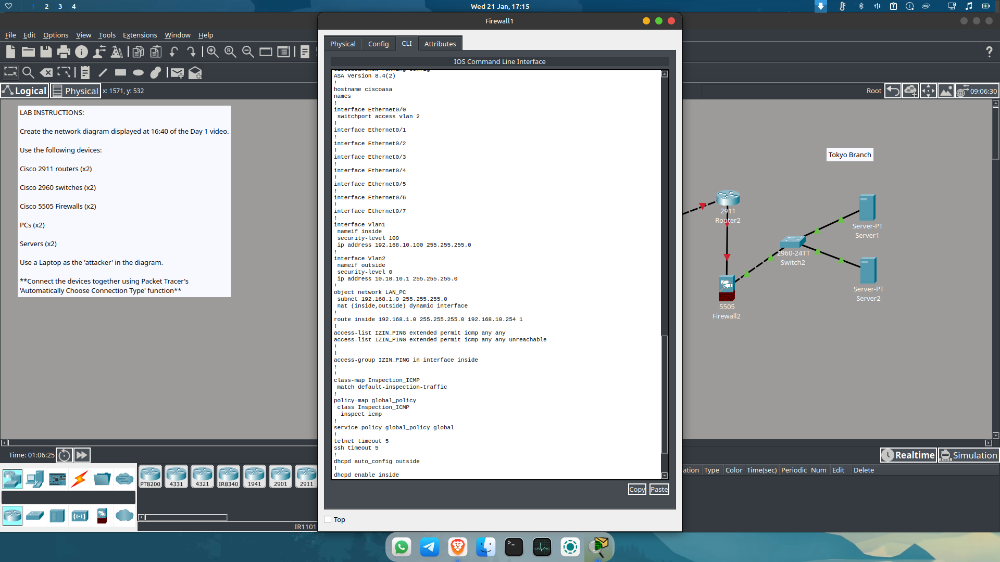
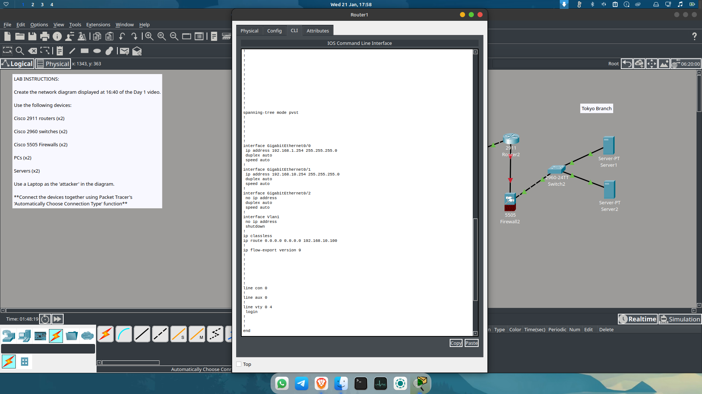
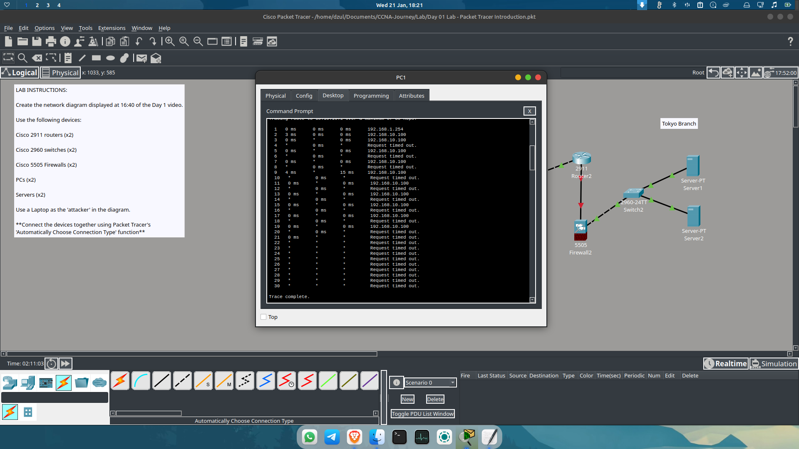
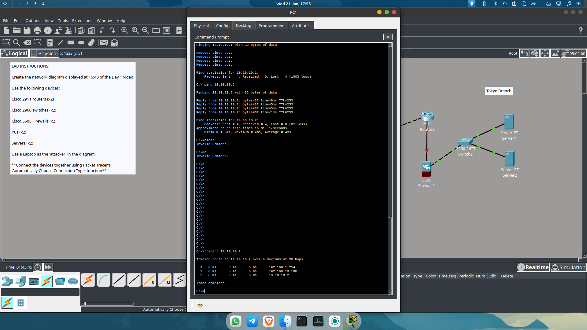

# Day 03: Dynamic NAT, Policy Maps, and Internet Connectivity

**Date:** 21 Januari 2026
**Current Focus:** Implementing NAT and Security Policies for Internet Access.

---

## ⚙️ Configuration Progress

### 1. Advanced Firewall Configuration (ASA)
To allow internal traffic to reach the outside world, I implemented several key components on **Firewall1**:
* **NAT Objects:** Defined `object network LAN_PC` to enable dynamic NAT (inside, outside).
* **Modular Policy Framework (MPF):** * Created a `class-map` to identify traffic.
    * Configured a `policy-map` to inspect ICMP packets (Stateful Inspection).
    * Activated the configuration using `service-policy global_policy global`.

**Firewall CLI Details:**

### 2. Router Gateway Setup
Updated **Router1** to ensure it acts as the correct gateway for the internal segments before handing traffic off to the Firewall.

**Router CLI Details:**

---

## 🛠 Troubleshooting: Routing Loops & Access Controls

### 3. Identifying the Routing Loop
While testing connectivity from **PC1** to the internet, I encountered a routing loop.
* **The Symptom:** `traceroute` showed packets bouncing back and forth between the same hops without reaching the destination.
* **The Cause:** Missing or incorrect routes on the router that didn't point correctly to the next hop.

**Traceroute Error Log:**

### 4. Final Fix: Outside ACLs & Route Updates
To allow the ping to be successful from PC1 to the Internet:
* **ACL Permission:** The access-list `IZIN_PING` was permitted and applied to the **outside** interface via `access-group`. This ensures return traffic or pings to the outside are authorized by the firewall.
* **Route Update:** Added a default static route to the internet gateway.

**Updated Routing Configuration:**

---

## ✅ Verification
After all adjustments, **PC1** can now successfully ping and traceroute to the external network or internet (10.10.10.2).

**Connectivity Test Result:**

---
*Next Step: Establishing connectivity to the Tokyo Branch Servers (Server1 & Server2).*
