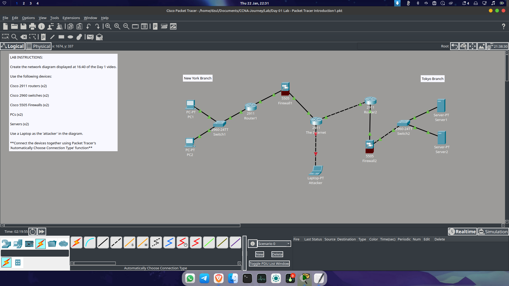
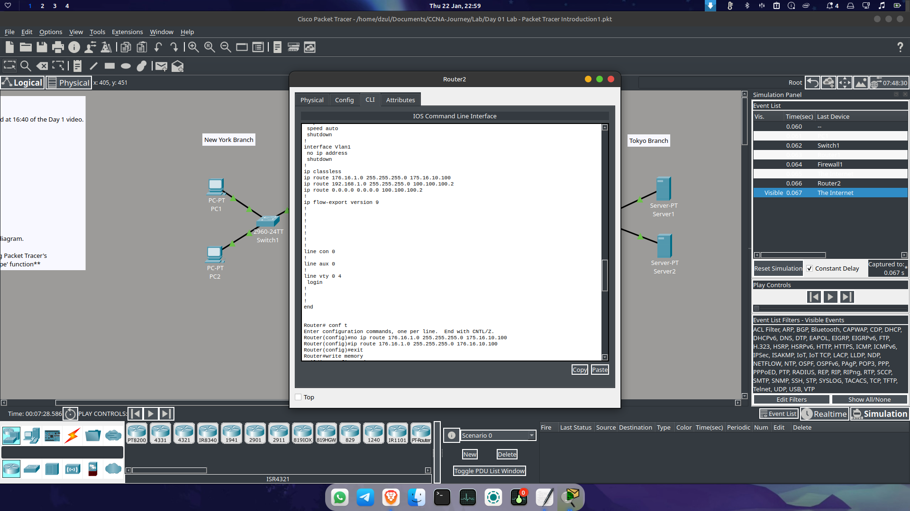
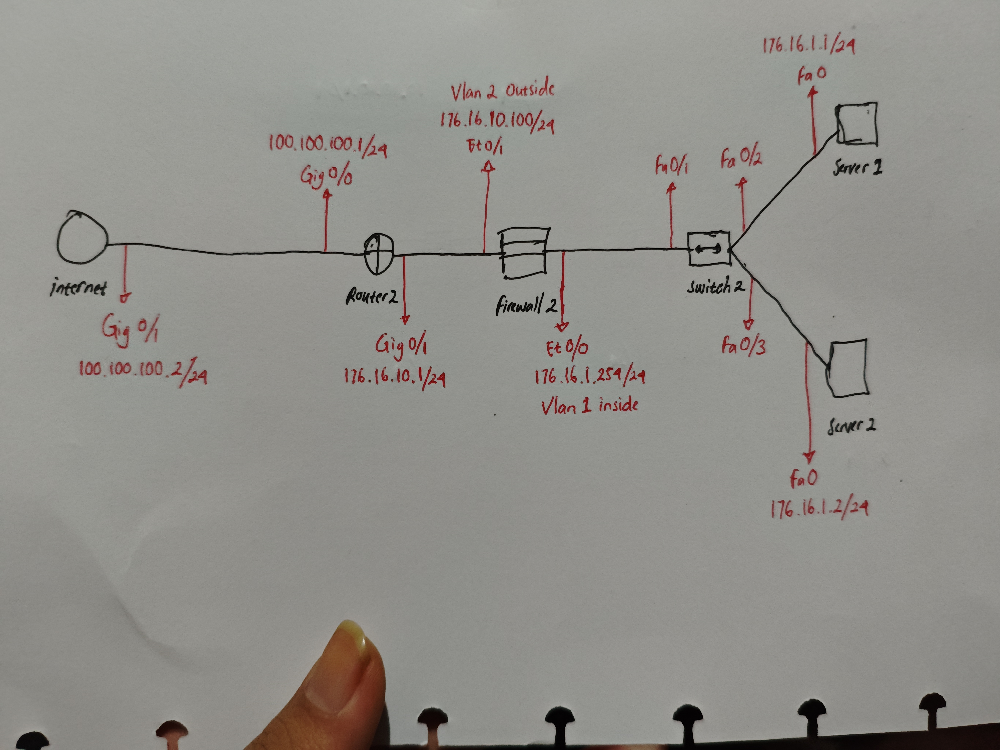
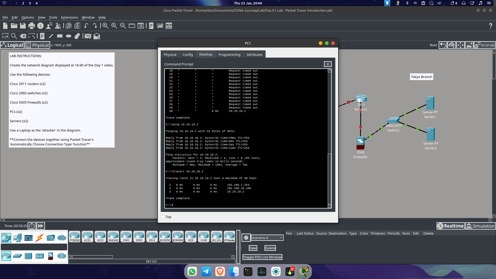

# Day 04: Tokyo Branch Connectivity and Server Configuration

**Date:** 22 Januari 2026
**Focus:** Establishing end-to-end connectivity between New York PCs and Tokyo Branch Servers.

---

## 🛠 Troubleshooting & Re-configuration

### 1. Recovering from Data Loss
Due to an oversight in saving the lab files yesterday, I had to re-configure the entire setup from Day 3. While frustrating, repeating the configuration actually helped me understand the command flow much better.
> *Note: Always remember to `write memory` or `copy run start`!*

### 2. Resolving IP Mismatch & Typos
I spent considerable time troubleshooting why the servers wouldn't connect. 
* **The Root Cause:** The Server IP address was on the wrong segment. I initially set it to a `172.x` address, but it should have been `176.x` to match the ASA Firewall's subnet.
* **Command Typos:** I also encountered errors in the static route configurations due to simple typing mistakes.

**Error Visualization:**

---

## 🚀 Configuration Progress

### 3. Tokyo Branch Topology
I designed and implemented the infrastructure for the Tokyo Branch, which includes **Router2**, **Firewall2**, and a Server Farm.
* **Segmentation:** * **VLAN 1 (Inside):** For the internal server network.
    * **VLAN 2 (Outside):** For the connection leading back to the internet/New York branch.

**Tokyo Topology Diagram:**

### 4. Advanced Routing & Policy Logic
To ensure packets can travel from the New York Branch to Tokyo:
* **Default Routing:** Configured a default route (`0.0.0.0 0.0.0.0 192.168.10.100`) to direct unknown traffic to the gateway.
* **ASA Implementation:** On **Firewall1**, I re-established the object networks and service policies (class-map/policy-map).
* **ICMP Access:** Re-applied the `IZIN_PING` access-list to the **Outside** interface using an access-group to allow return traffic from the servers.

**Re-configuration Process:**

---

## ✅ Final Verification
After aligning the IP segments and correcting the routing typos, the connection is now stable.

* **Result:** **PC1** can now successfully `ping` and `traceroute` to **Server1** and **Server2** in the Tokyo Branch.

**Success Verification:**

---

## 💡 Key Takeaway
"This session taught me that networking requires 100% focus. A single digit error in an IP segment (`172` vs `176`) can break the entire path. I've learned that building a configuration 'roadmap' on paper first is much more efficient than troubleshooting typos later."

---
*Next Step: Day 5 - Entering the 'Attacker' phase to test firewall security hardening.*
