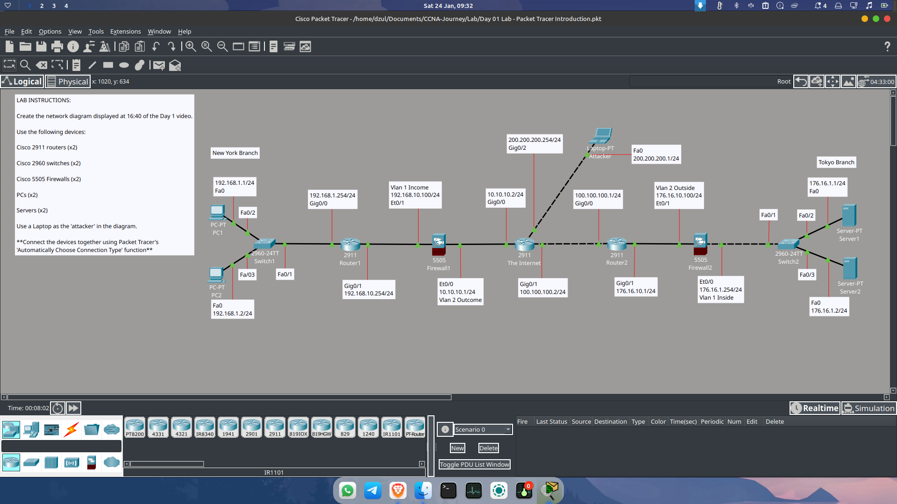
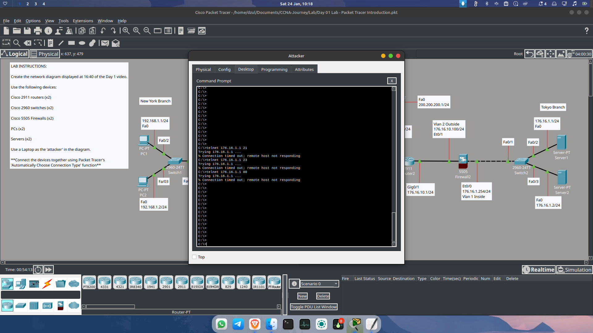
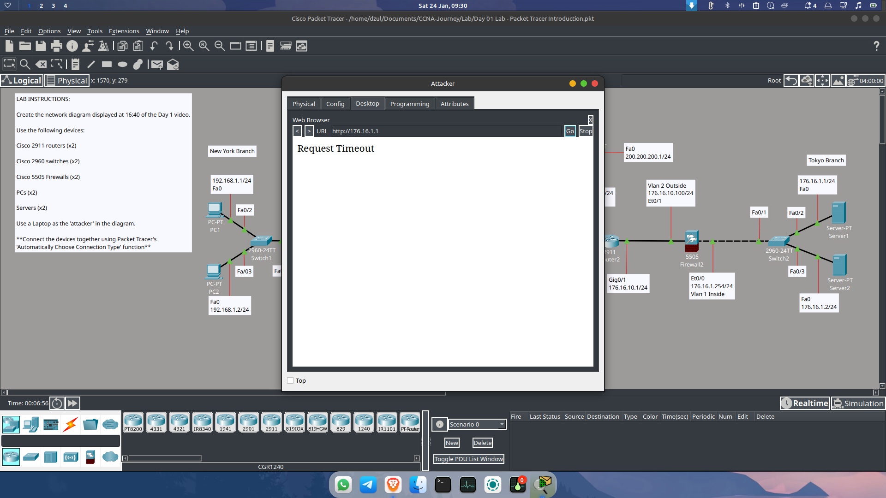
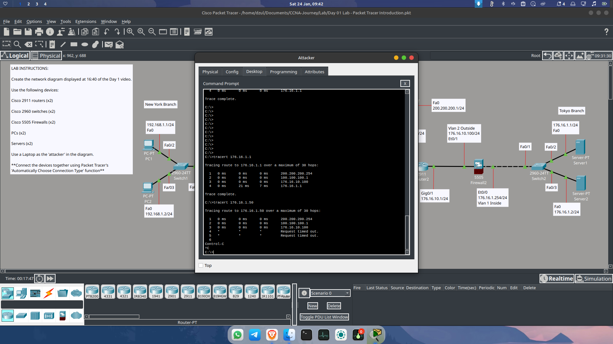

# Day 05: Security Analysis & Attack Simulation

**Date:** 23 Januari 2026
**Focus:** Testing Firewall Resilience and Understanding Information Leakage.

---

## 🗺 Topology Update
I have updated the network topology diagram to make the logical flow easier to understand, especially for the connection between the New York Branch, the Internet, and the Tokyo Branch.

---

## 🛡 Security Testing (Attacker Scenario)

In this session, I simulated an attack from the **Attacker Laptop** to see what a malicious actor could discover about the **Tokyo Branch Servers**.

### 1. The Vulnerability
Currently, the **ASA Firewall** is configured with a very basic policy: `permit icmp any any`. 

### 2. Attack Simulation Results
* **ICMP Ping:** **SUCCESS.** The attacker can reach the servers, confirming they are "alive."

* **Telnet & HTTP Access:** **FAILED.** Since the firewall only permits ICMP, other services are effectively blocked.

* **Traceroute Discovery:** **SUCCESS.** This is the most dangerous part. By using traceroute, the attacker successfully:
    * Mapped the internal topology.
    * Identified the presence of a Firewall before the server.
    * Discovered the exact internal IP addresses of **Server1 (176.16.1.1)** and **Server2 (176.16.1.2)**.

### 3. Security Risk Assessment
While the attacker cannot access the data via HTTP or Telnet yet, the information gathered (IPs and Topology) is a goldmine for a skilled hacker. This "Information Leakage" can be used to launch more targeted attacks in the future.

---

## 🛠 Hardening Strategy
To mitigate these risks, the next step is to **harden the ASA configuration**:
* Restrict ICMP types (only allow specific echoes, block unreachable/time-exceeded to hide the hop-by-hop path).
* Implement stricter Access Control Lists (ACLs) based on specific source/destination requirements instead of using `any any`.

---

## 📚 Closing Note
Today's session was eye-opening regarding how even a "secure" firewall can leak sensitive network data if not configured deeply. I'm wrapping up here to continue with **Jeremy’s IT Lab Day 2 video** to strengthen my fundamental networking knowledge.

---
*Next Step: Deep dive into Jeremy's IT Lab day 2 videos.*
