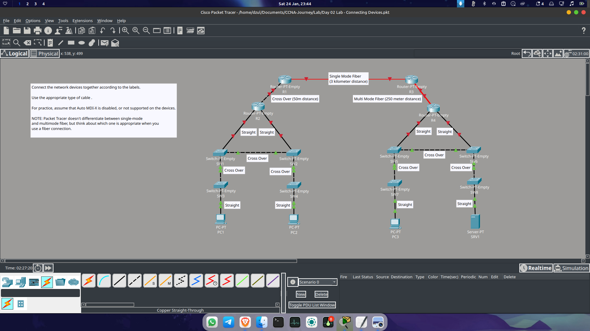
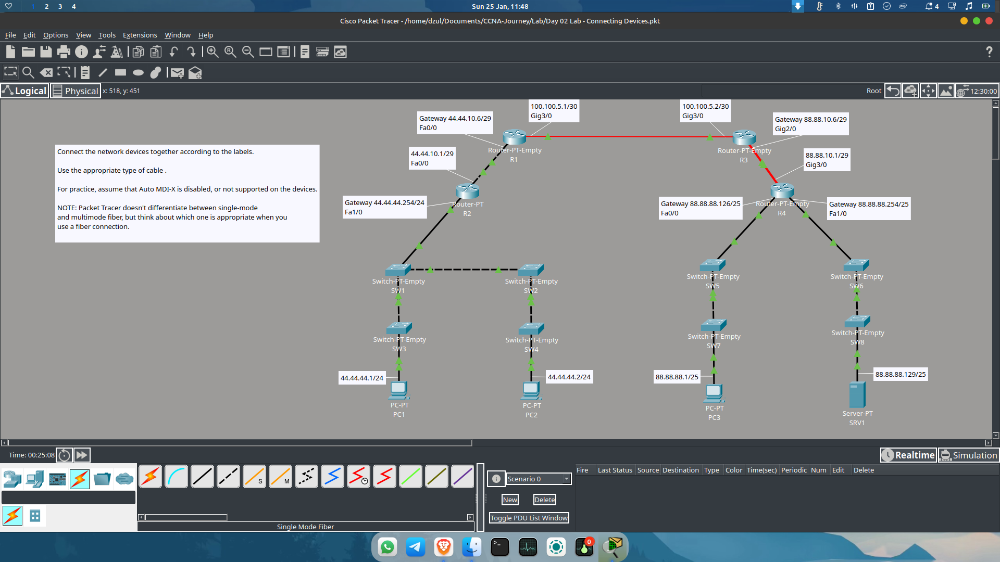
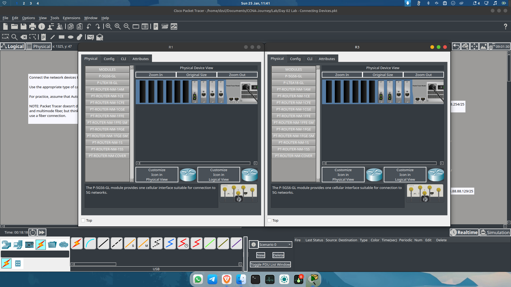
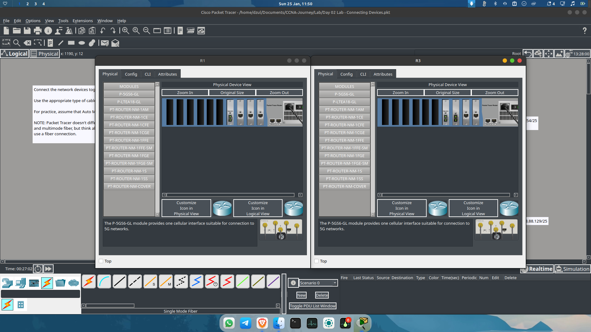
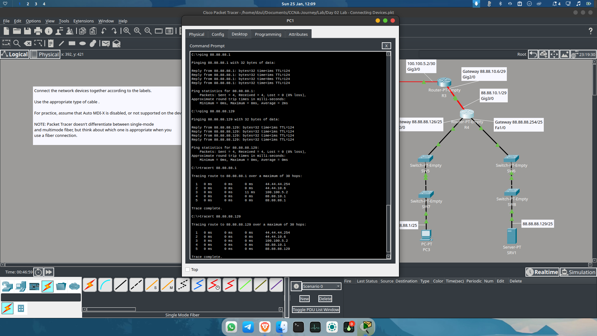

# Day 06: Layer 1 Physics, Subnetting Strategy & Module Mismatches

**Date:** 24 Januari 2026
**Focus:** Cabling Media (Copper vs. Fiber), Auto MDIX, and Advanced Subnetting Implementation.

---

## 📚 Theory: Revisiting Layer 1 Media

Today's session went back to basics, covering the physical layer media that underpins our networks.

### 1. UTP Cables (Copper)
* **Types:**
    * **Straight-through:** For connecting different devices (e.g., Switch to Router).
    * **Cross-over:** For connecting similar devices (e.g., Router to Router, Switch to Switch).
* **Constraints:** Maximum distance is **100 meters** due to signal attenuation in copper.
* **Modern Evolution:** Most modern devices support **Auto MDIX**, automatically detecting the cable type, rendering the strict "Straight vs. Cross" rule less critical in newer hardware.

### 2. Fiber Optic Cables (Light)
* **Mechanism:** Uses light pulses instead of electricity. Immune to EMI but fragile (cannot be bent sharply/kinked).
* **Modes:**
    * **Single Mode:** Long-range (up to ~30km), expensive laser source.
    * **Multimode:** Shorter range (max ~550m), cheaper LED source.

---

## 🛠 Lab Configuration & Topology Changes

**Original Topology**

### 1. Subnetting Strategy (/30 vs /29)
I implemented specific subnet masks to mirror professional real-world environments:
* **Router1 to Router3:** Used a **/30** subnet.
    * *Reasoning:* This provides exactly 2 host IPs. It is secure because it leaves no unused IP addresses for a hacker to hijack on that link.
* **R2-R1 & R4-R3:** Used a **/29** subnet.
    * *Reasoning:* Reserved for scalability/future expansion.

### 2. The "/25" Subnet Challenge (Split Horizon)
* **Initial Plan:** Assign **/25** subnets for the Router4 connection to **PC3** and **Server1**.
* **The Issue:** **Switch5** and **Switch6** were physically connected via a Cross-over cable. This merged them into a single broadcast domain, making it impossible to separate the networks into two distinct /25 subnets effectively.
* **The Fix:** I physically removed the Cross-over cable between Switch5 and Switch6. This isolation allowed independent routing for PC3 and Server1.

**Modified Topology**

---

## ⚙️ Hardware Troubleshooting: The Fiber Module Mismatch

While following Jeremy's video, I encountered a physical layer mismatch on the connection between **Router1** and **Router3**.

* **The Problem:** The default module in the lab was **FGE** (Fiber Gigabit Ethernet), which operates on *Multimode*. However, I intended to simulate a long-distance link using *Single Mode*.
**Module does not Match**

* **The Solution:**
    * **Router1:** Swapped the module to **FGE-SM** (Single Mode).
    * **Router3 (Hybrid Setup):**
        * Interface to R1: Used **FGE-SM** (to match Router1).
        * Interface to R4: Kept as standard **FGE**.
**Appropriate Module**

---

## ✅ Verification

After configuring the specific routes for the new **/25** networks:

1.  **Routing Table:** Verified separate entries for PC3 and Server1 networks.
2.  **Connectivity:**
    * **Ping:** PC1 ➔ PC3 (Success)
    * **Ping:** PC1 ➔ Server1 (Success)
    * **Traceroute:** Validated the path through the new Single Mode link.
**Test Ping and TraceRoute**

---
*Next Step: Deep dive into Jeremy's IT Lab Day 3 videos.*
