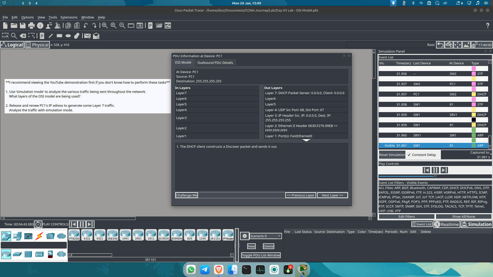

# Day 07: The OSI Model Concept & Data Flow

**Date:** 26 Januari 2026
**Focus:** Visualizing Network Traffic using the "Package Delivery" Analogy.

---

**OSI Model**

## 🧠 The OSI Model Analogy
To solidify my understanding of how data travels across a network, I mapped the technical process to a real-world logistics scenario.

### 📦 Phase 1: Sending (Encapsulation)

**1. Content Creation**
* **Analogy:** I wrap a package containing music to send to a friend.
* **Technical:** **Encapsulation (Layers 7-1)**. The data (payload) is generated by the application and prepared for transport.

**2. The Courier**
* **Analogy:** The package is handed to a courier/driver.
* **Technical:** **Layer 1 (Physical)**. The data is converted into bits and transmitted via physical media (UTP Cables, Fiber Optic, or WiFi).

---

### 🚚 Phase 2: Transit (Switching & Routing)

**3. The Local Branch**
* **Analogy:** The courier takes the package to a local branch office. They check the local label to see where it goes next.
* **Technical:** **Layer 2 (Data Link / Switch)**. The Switch inspects the **MAC Address** (Physical Address) to forward the frame within the Local Area Network (LAN).

**4. The Regional Hub**
* **Analogy:** The package arrives at a regional distribution center. Here, they decide which city/country the package needs to go to.
* **Technical:** **Layer 3 (Network / Router)**. The Router inspects the **IP Address** (Logical Address) to determine the best path to the destination network.

**5. The Highway (Internet)**
* **Analogy:** The package travels through various transit points, trucks, and planes.
* **Technical:** **The Internet**. The packet traverses the public network, hopping through multiple routers/ISPs.

---

### 📬 Phase 3: Receiving (Decapsulation)

**6. Destination Hub**
* **Analogy:** The package arrives at the recipient's regional center.
* **Technical:** **Layer 3 (Destination Router)**. The router accepts the packet and directs it toward the specific internal LAN.

**7. Destination Branch**
* **Analogy:** The package is sorted at the local delivery office for the final mile.
* **Technical:** **Layer 2 (Destination Switch)**. The switch uses the MAC address to deliver the frame to the specific end-device.

**8. Opening the Package**
* **Analogy:** The recipient receives the package, opens the box, and plays the music.
* **Technical:** **Decapsulation (Layers 1-7)**. The receiving device strips off the headers layer-by-layer (Physical -> Data Link -> Network -> Transport) until the original data is presented to the Application Layer.

---

## 💡 Key Takeaway
"Networking is essentially a sophisticated digital postal service. **Switches** care about the *local* next step (MAC), while **Routers** care about the *final* destination (IP)."

---
*Next Step: Deep dive into Jeremy's IT Lab Days 4 Videos.*
