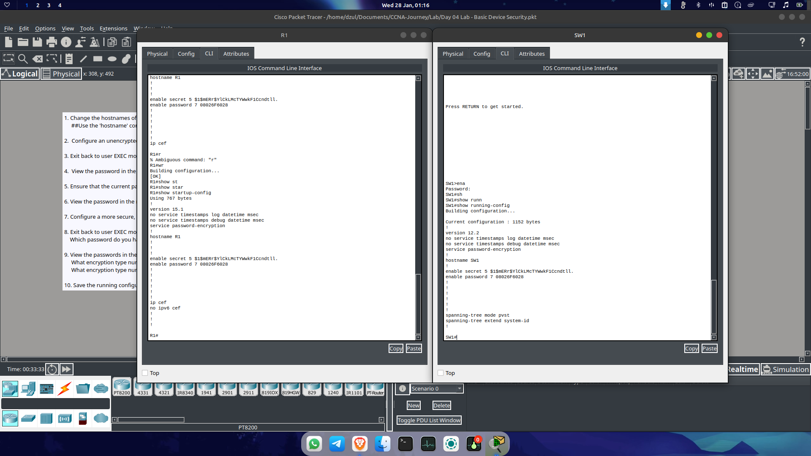

# Day 08: Device Hardening - Passwords & Encryption

**Date:** 27 Januari 2026
**Focus:** Basic Device Security, Legacy Compatibility, and Configuration Hiding.

---

## 🔐 Configuration: Securing the Exec Mode

Today's session was short but focused on a fundamental security best practice: locking down privileged access.

### 1. The Conflict: Password vs. Secret
I configured both an `enable password` and an `enable secret` on the same device to observe the behavior.
* **Observation:** When attempting to enter privileged exec mode (`enable`), the device **only accepted the `secret` password**.
* **The Logic:** Cisco IOS prioritizes `enable secret` because it uses a stronger hashing algorithm (MD5/Type 5) compared to the older `enable password`.

### 2. Why does `enable password` still exist?
If `secret` always takes precedence, why hasn't Cisco removed the standard `password` command?
* **Reason:** **Backward Compatibility.**
* It exists primarily for very old "legacy" devices or ancient IOS versions that do not support the hashing algorithms used by `secret`. In a modern environment, however, `enable secret` is the standard.

---

## 🛡️ Service Password Encryption

The most critical step I learned today was hiding the keys to the castle.

### The Problem: Plain Text Risks
By default, if I set a standard password, running the `show running-config` command reveals the password in **plain text**.
* *Risk:* Anyone looking over my shoulder (shoulder surfing) or anyone with access to the config file can read the password immediately.

### The Solution: `service password-encryption`
* **Command:** `service password-encryption`
* **Result:** This command applies a basic encryption (Type 7) to all current and future plain-text passwords in the configuration file. It ensures that passwords act as "cipher text" in the display, rather than readable words.

**Password Configuration**

---

## 💡 Key Takeaway
"Always use `enable secret` over `enable password` for better security. Furthermore, a configuration is not complete without `service password-encryption` to prevent passwords from showing up naked in the `show run` output."

---
*Next Step: Deep dive into Jeremy's IT Lab Days 5 and 6 Videos.*
