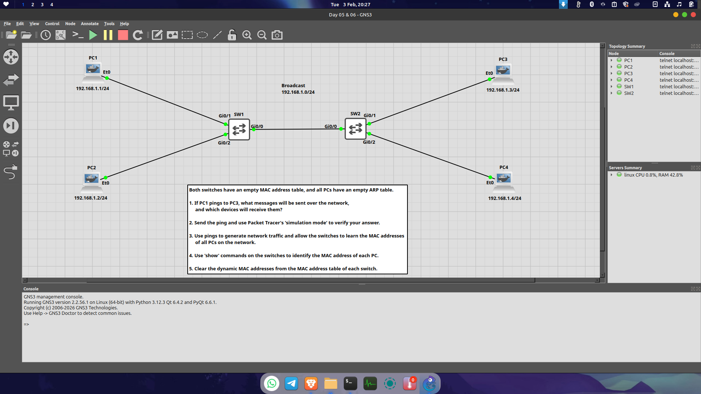
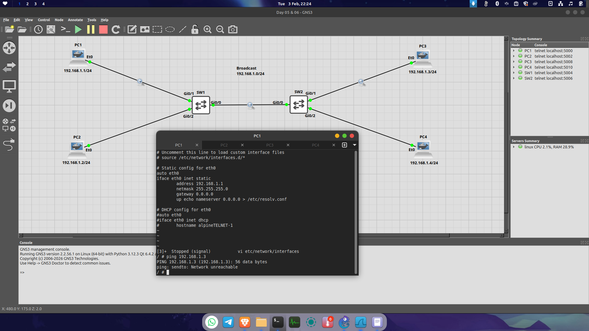
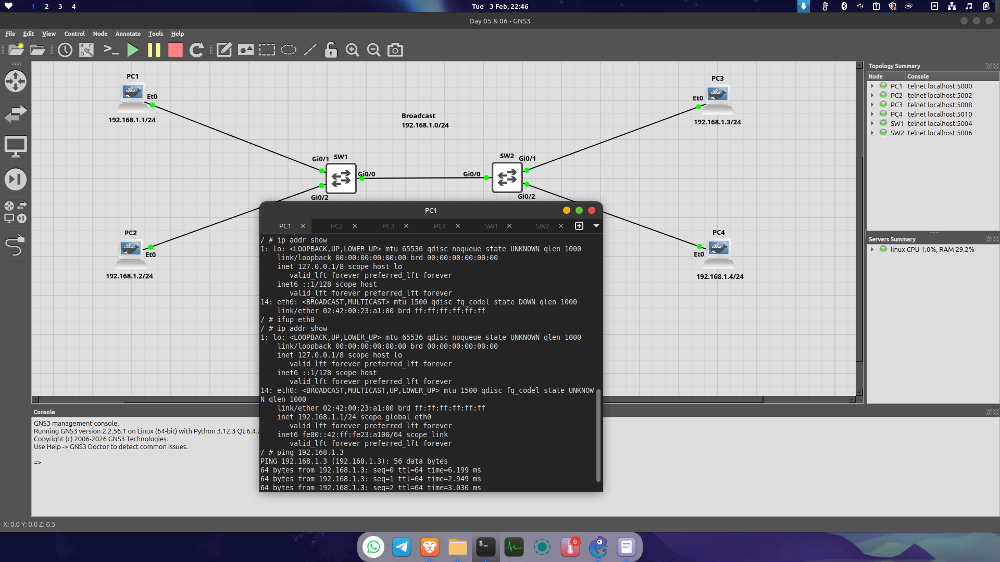
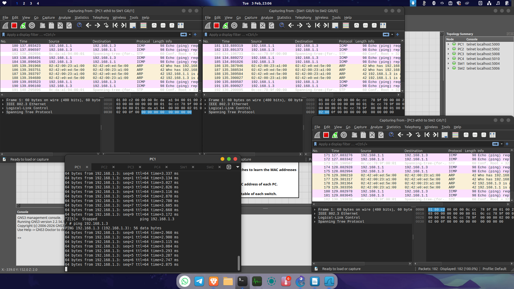
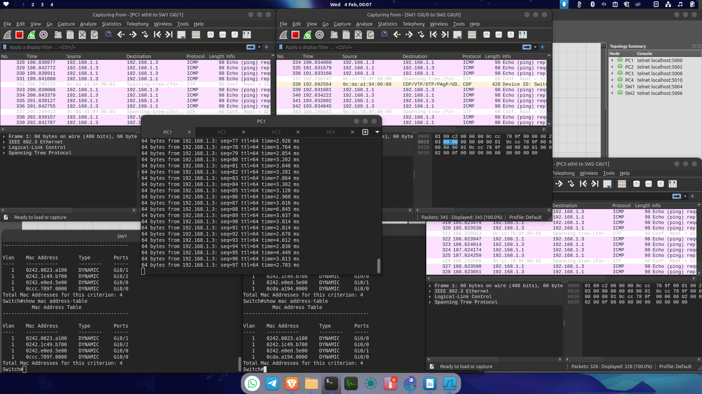
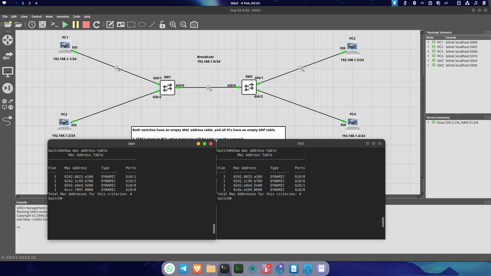

# Day 09: Moving to GNS3 & Deep Dive into ARP & MAC Address Tables

**Date:** 4 Februari 2026
**Focus:** GNS3 Environment Setup, Linux Networking, and Layer 2 Switching Logic.

---

**Topology**

## 🛠 Transitioning to GNS3
I decided to move from Packet Tracer to **GNS3** to experience a more professional and realistic lab environment. 
* **Key Difference:** In GNS3, devices like Alpine Linux don't just "work" out of the box. I learned that manual interface activation is required, unlike the automated nature of Packet Tracer.

### The Gateway & Alpine Linux Mystery

**Network Unreachable**

* **The Issue:** I tried setting the gateway to `192.168.1.254` and `0.0.0.0`, but PC3 remained unreachable.
* **The Discovery:** In Alpine Linux, `0.0.0.0` is an invalid address. Furthermore, for local-only topologies (connected via Switch), a gateway is **not required**. I commented out the gateway using `#` in the configuration.
* **The Fix:** The real problem was the `eth0` interface was down. I had to manually bring it up even after configuring the `/etc/network/interfaces` file.
* **Lesson Learned:** If devices are in the same subnet, they use **ARP**, not the Gateway. The Gateway is only needed to exit the local network.

**Fix Network Unreachable**

---

## 🔍 Layer 2 Communication: The ARP "Shout"
I visualized the process of PC1 communicating with PC3 for the first time:

**Wireshark**

1. **ARP Request (The Shout):** PC1 doesn't know PC3's MAC. It broadcasts: *"Who has IP 192.168.1.3?"*
2. **Switch Role:** The Switch receives this and uses its "megaphone" (broadcast) to all ports: *"Who has 192.168.1.3?"*
3. **ARP Reply:** PC3 hears it and replies with its MAC address.
4. **Learning:** As the reply passes through, the switches record PC3's MAC in their MAC Tables.
5. **ICMP Flow:** Once MACs are known, the ICMP Echo Request/Reply (Ping) flows smoothly.

---

## 📊 MAC Address Table Analysis

**Mac Table Analysis**

After clearing the tables on **SW1** and **SW2** and pinging from PC1 to PC3, here is the accurate result of how the switches learned the addresses:

### SW1 MAC Table
SW1 populated 4 entries:
* `0242.0023.a100` → **PC1** (Gi0/1) - *Direct*
* `0242.1c49.b700` → **PC2** (Gi0/2) - *Direct*
* `0242.e0ed.5e00` → **PC3** (Gi0/0, via SW2) - *Learned from source MAC of frames returning from PC3*
* `0ccc.789f.0000` → **Bridge/STP MAC** (Gi0/0)
* *Note: MAC PC3 does appear in SW1 because PC3 sends frames (ARP Reply / ICMP Echo Reply) back toward PC1, and those frames enter SW1 through the link to SW2. Therefore, SW1 learns PC3’s MAC from the source MAC of returning traffic, not because PC3 is directly connected.*

### SW2 MAC Table
SW2 also populated 4 entries:
* `0242.0023.a100` → **PC1** (Gi0/0) - *Learned via SW1 link*
* `0242.1c49.b700` → **PC2** (Gi0/0) - *Learned via SW1 link*
* `0242.e0ed.5e00` → **PC3** (Gi0/1) - *Directly connected*
* `0cda.a194.0000` → **Internal Switch MAC / STP** (Gi0/0)
* *Note: PC4 is missing because it hasn't sent any traffic, so the switch hasn't learned its source MAC yet.*

### 💡 Conclusion on MAC Learning
A switch only learns a MAC address when it receives a frame; it records the **Source MAC** and the port it entered. 
* SW1 learns PC1 & PC2 from frames originating directly from them. 
* SW1 also learns PC3 from ARP Reply / ICMP Echo Reply frames sent back by PC3 through SW2.
* SW2 learns PC1 & PC2 from traffic forwarded by SW1.
* SW2 learns PC3 because PC3 is directly connected.

---

## 🖼 Verification Screenshot
Below is the actual MAC Table output from the GNS3 console:

**Mac Table**

---
*Next Step: Deep dive into Jeremy's IT Lab Day 7-8 - IPv4 Addressing.*
